# PGymP Frontend Crash Course

This guide is based on the React frontend in this repo, but the focus is not React internals.

The focus is:

- JavaScript syntax used in the files
- JSX, which is the HTML-looking syntax inside React components
- CSS syntax used for styling
- What each component does

This guide intentionally avoids deep backend and React lifecycle details.

---

## Table of Contents

1. Big Picture
2. File Map
3. JSX: HTML-Like Syntax
4. JavaScript Syntax Used Here
5. CSS Syntax Used Here
6. Component Guide
7. Page Components
8. Practice Components
9. Images and Assets
10. Common Syntax Notes
11. Cheat Sheet

---

## 1. Big Picture

The frontend is a Vite + React app.

For this project, think of it like this:

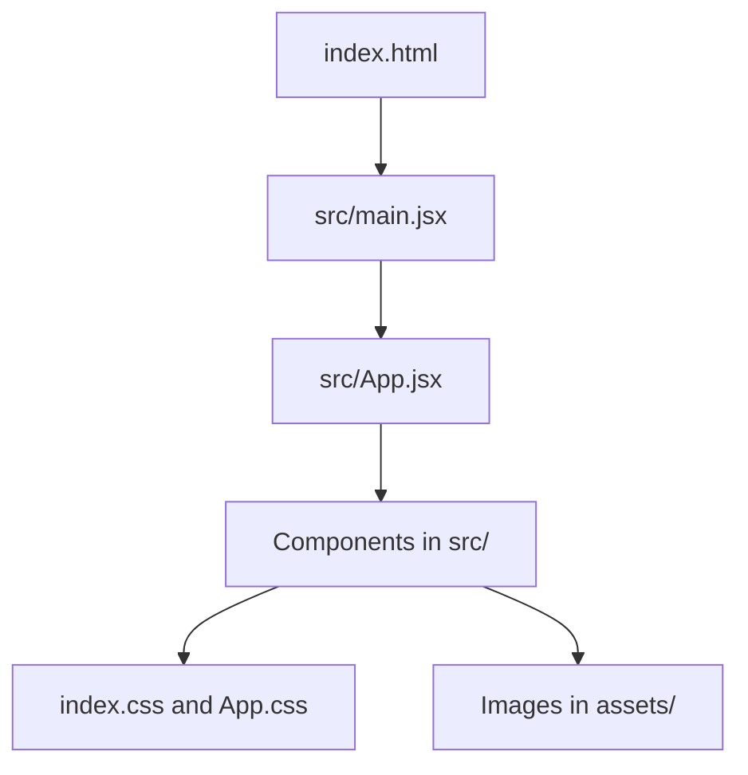

The important idea:

```text
Components return JSX.
JSX looks like HTML.
CSS styles the JSX.
JavaScript controls values, clicks, forms, and lists.
```

---

## 2. File Map

```text
frontend/
  index.html
  package.json
  vite.config.js
  src/
    main.jsx
    App.jsx
    index.css
    App.css
    Header.jsx
    Footer.jsx
    AuthFlow.jsx
    GymCapacityBox.jsx
    Gymequipment.jsx
    card.jsx
    loginbutton.jsx
    student.jsx
    counter.jsx
    todo.jsx
    digitalclock.jsx
    dynamicwindow.jsx
    Pages/
      AboutPage.jsx
      ContactPage.jsx
      FeedbackPage.jsx
    assets/
      images
```

### Component Map

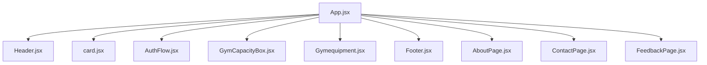

---

## 3. JSX: HTML-Like Syntax

JSX is the syntax that looks like HTML inside `.jsx` files.

Example:

```jsx
function Footer() {
  return (
    <footer>
      <p>&copy; {new Date().getFullYear()} Orbital Soma and Raghav</p>
    </footer>
  );
}
```

### HTML vs JSX

| HTML | JSX |
|---|---|
| `class="card1"` | `className="card1"` |
| `for="input-id"` | `htmlFor="input-id"` |
| `onclick="..."` | `onClick={handleClick}` |
| `style="color:red"` | `style={{ color: "red" }}` |

### Curly Braces

In JSX, `{}` means "use JavaScript here."

Examples:

```jsx
<h2>{rawPercentage}% full</h2>
```

```jsx

```

```jsx
{errorMessage && <p>{errorMessage}</p>}
```

### JSX Must Return One Parent

Valid:

```jsx
return (
  <div>
    <h1>Hello</h1>
    <p>Welcome</p>
  </div>
);
```

Also valid because `<>...</>` is a fragment:

```jsx
return (
  <>
    <Header />
    <Footer />
  </>
);
```

Invalid:

```jsx
return (
  <Header />
  <Footer />
);
```

### JSX Comments

Inside JSX:

```jsx
{/* This is a JSX comment */}
```

Normal JavaScript comments:

```js
// This is a JavaScript comment
```

---

## 4. JavaScript Syntax Used Here

### Imports

Imports bring something from another file.

```jsx
import Header from "./Header.jsx";
import { useState, useEffect } from "react";
import benchImg from './assets/benchpress.png';
```

| Syntax | Meaning |
|---|---|
| `import Header from "./Header.jsx"` | Import a default export |
| `import { useState } from "react"` | Import a named export |
| `import benchImg from "./assets/benchpress.png"` | Import an image file |

### Exports

Exports let another file import this component.

```jsx
export default Footer;
```

### Functions

Most components are functions:

```jsx
function Header({ setCurrentPage }) {
  return <h1>PGymP</h1>;
}
```

Helper functions are also normal functions:

```jsx
function handleSubmitFeedback() {
  setSubmitted(true);
}
```

### Arrow Functions

Arrow functions are a shorter function syntax.

```jsx
const handleLogin = () => {
  console.log("Login button clicked");
};
```

Used directly in JSX:

```jsx
onClick={() => setCurrentPage("home")}
```

Meaning:

```text
When clicked, run setCurrentPage("home").
```

### `const`

`const` creates a variable that will not be reassigned.

```jsx
const maxCapacity = 30;
const qrCodeData = token ? token : "";
```

### Arrays

Arrays store lists.

```jsx
const equipment = [
  { name: "Benches", total: 2, inUse: 1, image: benchImg },
  { name: "Dumbbells", total: 10, inUse: 3, image: dumbellImg },
];
```

Diagram:

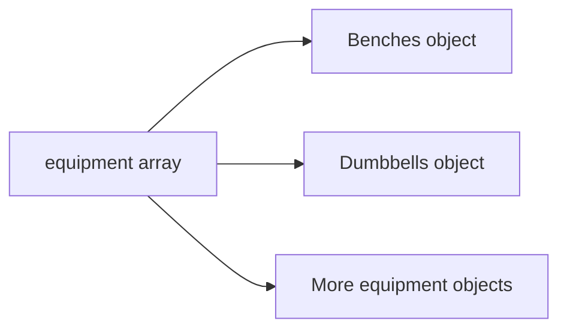

### Objects

Objects store related values as key-value pairs.

```js
{
  name: "Benches",
  total: 2,
  inUse: 1,
  image: benchImg
}
```

Access values with dot syntax:

```jsx
item.name
item.total
item.inUse
item.image
```

### Destructuring

Destructuring pulls values out of something.

Props destructuring:

```jsx
function GymCapacityBox({ currentCapacity, maxCapacity }) {
```

Array destructuring:

```jsx
const [feedback, setFeedback] = useState("");
```

Meaning:

| Part | Meaning |
|---|---|
| `feedback` | Current value |
| `setFeedback` | Function used to change it |

### Template Strings

Template strings use backticks.

```jsx
width: `${percentage}%`
```

If `percentage` is `60`, this becomes:

```text
"60%"
```

### Ternary Operator

A ternary is a short if/else.

```jsx
const qrCodeData = token ? token : "";
```

Meaning:

```text
If token exists, use token.
Otherwise, use an empty string.
```

Another example:

```jsx
{authStep < 4 ? <AuthFlow /> : <SuccessCard />}
```

### Logical AND Rendering

```jsx
{errorMessage && <p>{errorMessage}</p>}
```

Meaning:

```text
If errorMessage exists, show the paragraph.
If not, show nothing.
```

### `.map()`

`.map()` is used to create repeated UI from an array.

```jsx
{equipment.map((item) => {
  const available = item.total - item.inUse;
  return (
    <div key={item.name}>
      <h3>{item.name}</h3>
      <p>{available} / {item.total}</p>
    </div>
  );
})}
```

Diagram:

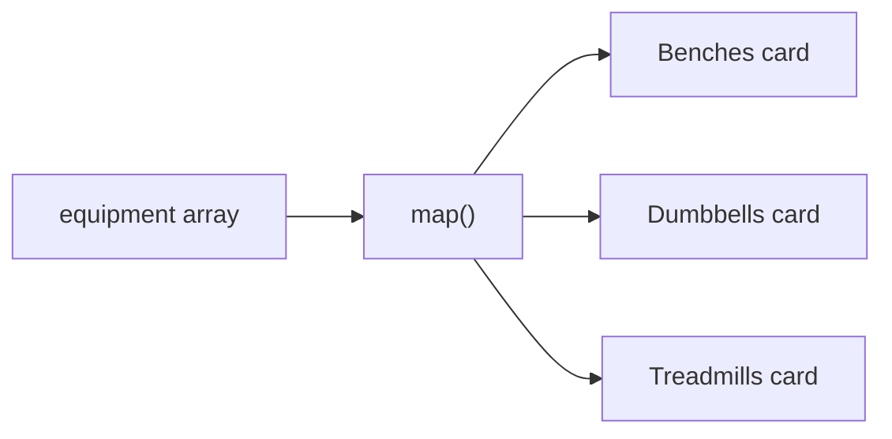

### `.filter()`

`.filter()` creates a new array with only the items you want.

```jsx
selectedEquipment.filter(e => e !== itemName)
```

Meaning:

```text
Keep every selected item except itemName.
```

### Spread Syntax

Spread copies items from an array or object.

Array:

```jsx
setSelectedEquipment([...selectedEquipment, itemName]);
```

Style object:

```jsx
style={{ ...styles.progressFiller, width: `${percentage}%` }}
```

---

## 5. CSS Syntax Used Here

The project uses:

1. CSS classes in `.css` files
2. Inline style objects inside `.jsx` files

### CSS Classes

From `index.css`:

```css
.login-btn {
  background-color: rgb(60, 153, 128);
  color: white;
  border: none;
  border-radius: 25px;
  padding: 12px 30px;
}
```

Used in JSX:

```jsx
<button className="login-btn">Next</button>
```

### CSS Selectors

| Selector | Example | Meaning |
|---|---|---|
| Class | `.login-btn` | Selects `className="login-btn"` |
| Element | `footer` | Selects all footer elements |
| Descendant | `header li a` | Selects links inside list items inside header |
| Hover | `.login-btn:hover` | Applies when mouse hovers |
| Active | `.login-btn:active` | Applies when button is pressed |

### Flexbox

Example:

```css
.card-container {
  display: flex;
  justify-content: center;
  align-items: flex-start;
  width: 100%;
}
```

| Property | Meaning |
|---|---|
| `display: flex` | Use flexbox layout |
| `justify-content: center` | Center children horizontally |
| `align-items: flex-start` | Align children near the top |
| `width: 100%` | Take full width |

### Box Model

Example:

```css
.card1 {
  border: 1px solid rgb(224, 223, 223);
  border-radius: 10px;
  padding: 20px;
  margin: 10px;
  box-shadow: 5px 5px 15px rgba(0, 0, 0, 0.1);
}
```

Diagram:

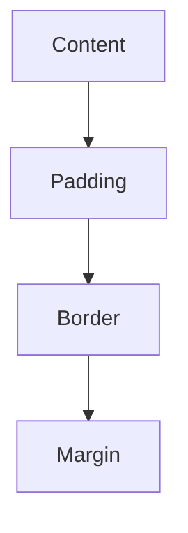

### Inline Styles

From `GymCapacityBox.jsx`:

```jsx
const styles = {
  card: {
    width: '200px',
    padding: '20px',
    borderRadius: '12px',
    backgroundColor: '#ffffff',
  }
};
```

Used like:

```jsx
<div style={styles.card}>
```

### CSS File vs Inline Style

| CSS File | Inline Style Object |
|---|---|
| `background-color` | `backgroundColor` |
| `border-radius` | `borderRadius` |
| `font-size` | `fontSize` |
| `text-align` | `textAlign` |
| `box-shadow` | `boxShadow` |

Rule:

```text
CSS files use kebab-case.
Inline JavaScript style objects use camelCase.
```

---

## 6. Component Guide

### `main.jsx`

Purpose:

Starts the app and renders `App`.

```jsx
createRoot(document.getElementById('root')).render(
  <StrictMode>
    <App />
  </StrictMode>,
)
```

What it does:

1. Finds `<div id="root"></div>` in `index.html`.
2. Places `<App />` inside it.

### `App.jsx`

Purpose:

The main file that decides what appears on screen.

It imports the other components:

```jsx
import Header from "./Header.jsx";
import Footer from "./Footer.jsx";
import Gymequipment from "./Gymequipment.jsx";
import Card from "./card.jsx";
import AuthFlow from "./AuthFlow.jsx";
import GymCapacityBox from './GymCapacityBox';
```

It stores main screen values:

```jsx
const [token, setToken] = useState(null);
const [authStep, setAuthStep] = useState(1);
const [userId, setUserId] = useState(null);
const [currentCapacity, setCurrentCapacity] = useState(13);
const [currentPage, setCurrentPage] = useState("home");
```

It chooses pages:

```jsx
if (currentPage === "feedback") {
  return (
    <>
      <Header setCurrentPage={setCurrentPage} />
      <FeedbackPage setCurrentPage={setCurrentPage} />
      <Footer />
    </>
  );
}
```

Page-choice diagram:

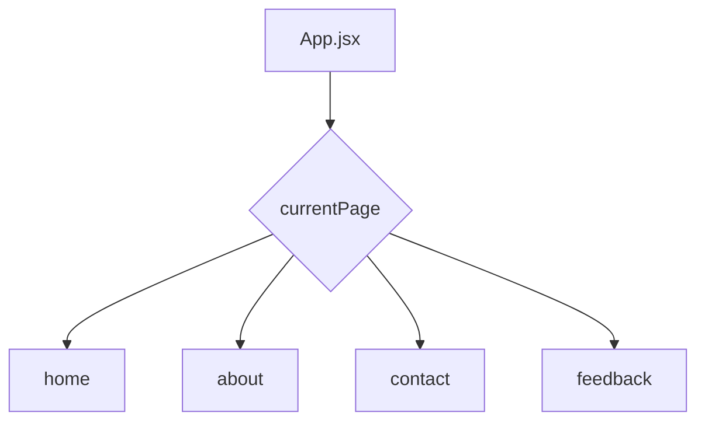

### `Header.jsx`

Purpose:

Displays the title and navigation links.

```jsx
<header style={styles}>
  <h1>PGymP</h1>
  <nav>
    <ul>
      <li><a href="#" onClick={() => setCurrentPage("home")}>Home</a></li>
      <li><a href="#" onClick={() => setCurrentPage("about")}>About</a></li>
      <li><a href="#" onClick={() => setCurrentPage("contact")}>Contact</a></li>
      <li><a href="#" onClick={() => setCurrentPage("feedback")}>Feedback</a></li>
    </ul>
  </nav>
</header>
```

Key syntax:

```jsx
onClick={() => setCurrentPage("about")}
```

This changes the visible page.

### `Footer.jsx`

Purpose:

Displays the footer.

```jsx
<footer>
  <p>&copy; {new Date().getFullYear()} Orbital Soma and Raghav</p>
</footer>
```

Key syntax:

```jsx
{new Date().getFullYear()}
```

This displays the current year.

### `card.jsx`

Purpose:

Displays the PGymP logo card.

```jsx
<div className="card1">
  
  <h2 className="card-title">PGymP Orbital</h2>
  <p className="card-text">Better Gym Experience Starts Today</p>
</div>
```

Key syntax:

```jsx
import gymlogo from "./assets/6040568.png";
```

### `GymCapacityBox.jsx`

Purpose:

Shows today's gym capacity as text and a progress bar.

Props:

```jsx
function GymCapacityBox({ currentCapacity, maxCapacity }) {
```

Calculates the percentage:

```jsx
const rawPercentage = Math.round((currentCapacity / maxCapacity) * 100);
const percentage = Math.min(Math.max(rawPercentage, 0), 100);
```

Displays it:

```jsx
<h2>{rawPercentage}% full</h2>
```

Sets progress bar width:

```jsx
<div style={{ ...styles.progressFiller, width: `${percentage}%` }}></div>
```

Diagram:

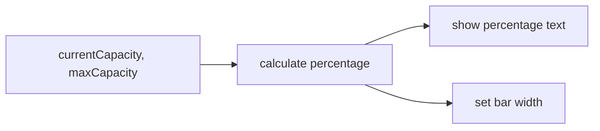

### `Gymequipment.jsx`

Purpose:

Displays equipment availability cards.

It imports images:

```jsx
import benchImg from './assets/benchpress.png';
import dumbellImg from './assets/dumbell.png';
```

It defines equipment data:

```jsx
const equipment = [
  { name: "Benches", total: 2, inUse: 1, image: benchImg },
  { name: "Dumbbells", total: 10, inUse: 3, image: dumbellImg },
];
```

It loops through the list:

```jsx
{equipment.map((item) => {
  const available = item.total - item.inUse;
  return (
    <div style={styles.card} key={item.name}>
      
      <h3 style={styles.name}>{item.name}</h3>
      <p style={styles.availability}>{available} / {item.total}</p>
      <p style={styles.availableText}>Available</p>
    </div>
  );
})}
```

### `AuthFlow.jsx`

Purpose:

Displays the sign-in/check-in flow.

It stores input values:

```jsx
const [matricId, setMatricId] = useState("");
const [password, setPassword] = useState("");
const [errorMessage, setErrorMessage] = useState("");
const [selectedEquipment, setSelectedEquipment] = useState([]);
```

It changes what form is visible using `authStep`.

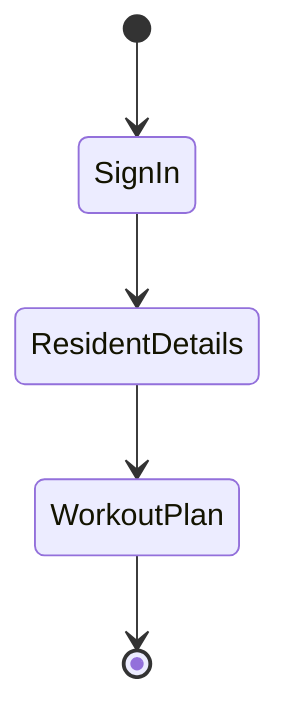

#### Sign In Form

```jsx
<input
  type="text"
  placeholder="NUS Matric ID"
  value={matricId}
  onChange={(e) => setMatricId(e.target.value)}
  required
/>
```

Important syntax:

| Syntax | Meaning |
|---|---|
| `value={matricId}` | Input shows current value |
| `onChange={(e) => ...}` | Runs when user types |
| `e.target.value` | The typed text |
| `required` | Browser requires field |

#### Resident Details Form

Uses normal form elements:

```jsx
<select required>
  <option value="">Select House...</option>
  <option value="lighthouse">LightHouse</option>
</select>
```

```jsx
<input type="number" placeholder="Block Number" min="1" required />
```

#### Workout Plan Form

Uses checkboxes:

```jsx
<input
  type="checkbox"
  id={item.name}
  checked={selectedEquipment.includes(item.name)}
  onChange={() => handleEquipmentSelect(item.name)}
/>
```

Important syntax:

| Syntax | Meaning |
|---|---|
| `type="checkbox"` | Creates checkbox |
| `checked={...}` | Whether it is selected |
| `.includes(item.name)` | Checks if item is in array |
| `onChange={() => ...}` | Runs when checkbox changes |

### `loginbutton.jsx`

Purpose:

Simple login button example.

```jsx
function LoginButton() {
  const handleLogin = () => {
    console.log("Login button clicked");
  };

  return (
    <button className="login-btn" onClick={handleLogin}>
      Login
    </button>
  );
}
```

### `student.jsx`

Purpose:

Shows simple props usage.

```jsx
function Student(props) {
  return (
    <div className="student-info">
      <p>Name: {props.name}</p>
      <p>Block: {props.block}</p>
      <p>Is Resident: {props.isResident ? "Yes" : "No"}</p>
    </div>
  );
}
```

---

## 7. Page Components

### `AboutPage.jsx`

Purpose:

Displays the About page placeholder.

```jsx
<div className="widgetContainer">
  <h1>About</h1>
</div>
```

### `ContactPage.jsx`

Purpose:

Displays the Contact page placeholder.

```jsx
<div className="widgetContainer">
  <h1>Contact Us</h1>
</div>
```

### `FeedbackPage.jsx`

Purpose:

Lets the user type feedback and submit it.

State:

```jsx
const [feedback, setFeedback] = useState("");
const [submitted, setSubmitted] = useState(false);
```

Textarea:

```jsx
<textarea
  className="feedback-textarea"
  placeholder="Write your feedback here..."
  value={feedback}
  onChange={(e) => setFeedback(e.target.value)}
/>
```

Conditional display:

```jsx
{submitted ? (
  <h1>Submitted!</h1>
) : (
  <div className="feedback-card">...</div>
)}
```

Diagram:

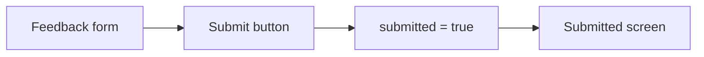

---

## 8. Practice Components

These are learning/demo components that are currently not part of the main displayed app.

### `counter.jsx`

Purpose:

Simple counter.

```jsx
const [count, setCount] = useState(0);
```

```jsx
setCount(count + 1);
setCount(count - 1);
```

### `todo.jsx`

Purpose:

Simple to-do list.

```jsx
const [tasks, setTasks] = useState([]);
const [newTask, setNewTask] = useState("");
```

Add task:

```jsx
setTasks(t => [...t, newTask]);
```

Delete task:

```jsx
const updatedTasks = tasks.filter((_, i) => i !== index);
setTasks(updatedTasks);
```

### `digitalclock.jsx`

Purpose:

Displays the current time.

```jsx
const [currentTime, setCurrentTime] = useState(new Date());
```

```jsx
{currentTime.toLocaleTimeString()}
```

### `dynamicwindow.jsx`

Purpose:

Displays browser width and height.

```jsx
const [width, setWidth] = useState(window.innerWidth);
const [height, setHeight] = useState(window.innerHeight);
```

```jsx
<p>Width: {width}</p>
<p>Height: {height}</p>
```

---

## 9. Images and Assets

Images are inside:

```text
frontend/src/assets/
```

Import:

```jsx
import gymlogo from "./assets/6040568.png";
```

Use:

```jsx

```

For equipment:

```jsx

```

Diagram:

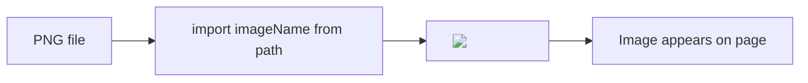

---

## 10. Common Syntax Notes

### CSS File Syntax vs Inline Style Syntax

In CSS files, use this:

```css
background-color: white;
border-radius: 12px;
box-shadow: 0 4px 12px rgba(0, 0, 0, 0.1);
text-align: center;
```

Inside JSX style objects, use this:

```jsx
style={{
  backgroundColor: "white",
  borderRadius: "12px",
  boxShadow: "0 4px 12px rgba(0, 0, 0, 0.1)",
  textAlign: "center"
}}
```

### Component Names Should Be Capitalized

Current:

```jsx
function card() {
```

Better:

```jsx
function Card() {
```

### Add `key` When Using `.map()`

Good:

```jsx
{equipmentData.map((item) => (
  <div key={item.name}>
    ...
  </div>
))}
```

### File Name Casing Should Match

If the file is:

```text
dynamicwindow.jsx
```

The import should match that casing.

---

## 11. Cheat Sheet

### Component

```jsx
function ComponentName() {
  return <div>Hello</div>;
}

export default ComponentName;
```

### Props

```jsx
function Welcome({ name }) {
  return <h1>Hello, {name}</h1>;
}
```

### State

```jsx
const [value, setValue] = useState("");
```

### Click

```jsx
<button onClick={handleClick}>Click</button>
```

### Inline Click

```jsx
<button onClick={() => setCurrentPage("home")}>Home</button>
```

### Input

```jsx
<input
  value={matricId}
  onChange={(e) => setMatricId(e.target.value)}
/>
```

### Textarea

```jsx
<textarea
  value={feedback}
  onChange={(e) => setFeedback(e.target.value)}
/>
```

### Conditional

```jsx
{submitted ? <h1>Submitted!</h1> : <FeedbackForm />}
```

### Show Only If Value Exists

```jsx
{errorMessage && <p>{errorMessage}</p>}
```

### List

```jsx
{items.map((item) => (
  <div key={item.name}>{item.name}</div>
))}
```

### CSS Class

```jsx
<button className="login-btn">Login</button>
```

```css
.login-btn {
  background-color: green;
}
```

### Inline Style

```jsx
<div style={{ color: "red", fontSize: "20px" }}>
  Text
</div>
```

### Image

```jsx
import logo from "./assets/logo.png";


```

---

## Final Summary

The frontend is mostly made from these patterns:

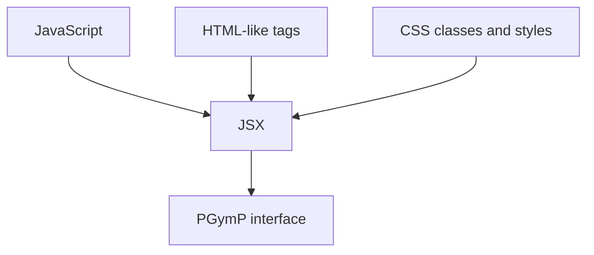

If you can read these, you can read most of the app:

- `import` brings code or images into a file.
- `function ComponentName()` defines a component.
- `return (...)` describes what appears on screen.
- `className` connects JSX to CSS.
- `{}` lets you write JavaScript inside JSX.
- `useState` stores values that change.
- `onClick`, `onChange`, and `onSubmit` handle user actions.
- `.map()` creates repeated UI from arrays.
- `style={{ ... }}` applies inline styles.

